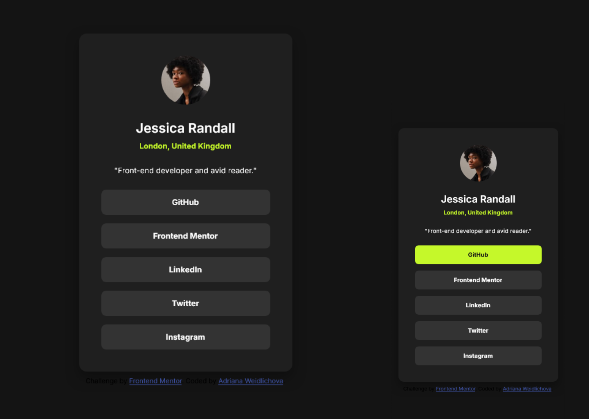

# Frontend Mentor - Social links profile solution

This is my solution to the [Social links profile challenge on Frontend Mentor](https://www.frontendmentor.io/challenges/social-links-profile-UG32l9m6dQ). 

## Table of contents

- [Frontend Mentor - Social links profile solution](#frontend-mentor---social-links-profile-solution)
  - [Table of contents](#table-of-contents)
  - [Overview](#overview)
    - [The challenge](#the-challenge)
    - [Screenshot](#screenshot)
    - [Links](#links)
  - [My process](#my-process)
    - [Built with](#built-with)
    - [What I learned](#what-i-learned)
    - [Continued development](#continued-development)
    - [Useful resources](#useful-resources)
  - [Author](#author)
  - [Acknowledgments](#acknowledgments)

**Note: Delete this note and update the table of contents based on what sections you keep.**

## Overview

### The challenge

The goal was to build a responsive social links profile card that matches the design as closely as possible, including hover states for all interactive elements.

### Screenshot



### Links

- Solution URL: [GitHub Repository](https://github.com/Saliva-sys/Social-links-profile)
- Live Site URL: [View Live](https://saliva-sys.github.io/Social-links-profile/)

## My process

### Built with

- Semantic HTML5 markup
- CSS custom properties (Variables)
- Flexbox (for layout and centering)
- Mobile-first workflow
- Media Queries for Desktop optimization

### What I learned

During this project, I focused on fine-tuning the responsiveness using relative units (rem) and Media Queries. I learned how to adjust typography and spacing precisely to achieve a professional result that scales smoothly across different screen sizes. By using max-width combined with percentage-based widths, I ensured the layout remains flexible on mobile while staying contained on desktop.

Example of my desktop adjustment:

```css
@media (min-width: 48rem) {
    .card {
        width: 21.75rem;
        padding: 2.25rem;
    }
}
```

### Continued development

In future projects, I want to focus on:

    Advanced CSS Grid: Using grid for more complex layouts, such as product listings in PrestaShop.

    Accessibility (a11y): Ensuring that all components are fully navigable by keyboard and screen readers.

    CSS variables for Theming: Mastering CSS variables to easily switch between light and dark modes or custom brand colors for clients.

### Useful resources

- [W3Schools](https://www.w3schools.com/) - This was my go-to guide for understanding how to create fluid layouts.
- [Google Fonts](https://fonts.google.com/) - Used for the Inter font family as per the design requirements.

## Author

- Frontend Mentor - [@Saliva-sys](https://www.frontendmentor.io/profile/Saliva-sys)
- GitHub - [Saliva-sys](https://github.com/Saliva-sys)

## Acknowledgments

I would like to thank the Frontend Mentor community for providing such great challenges to practice real-world web development skills.